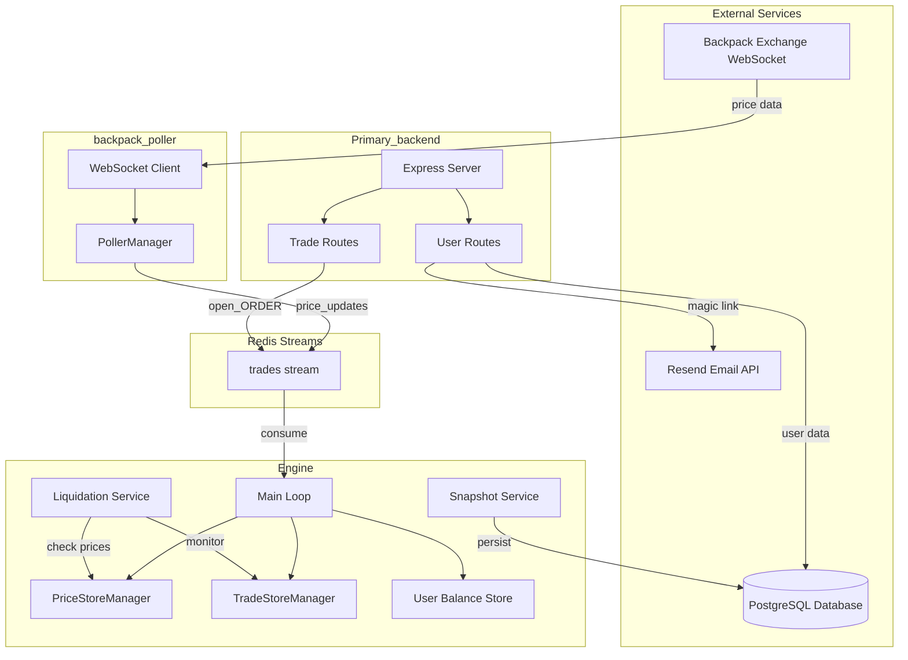
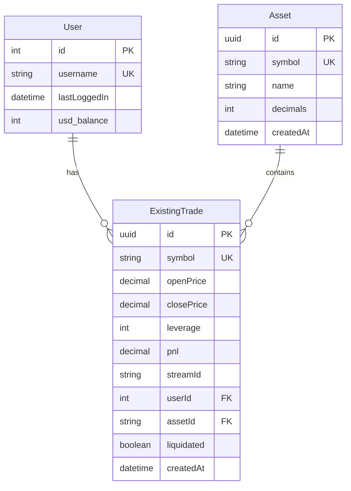

# Trading Platform - Data Flow & Architecture Documentation

> A comprehensive overview of the system architecture, data flow, function responsibilities, and remaining work.

---

## 📐 System Architecture Overview



---

## 🔄 Data Flow Diagram

### 1. Price Data Flow

```
Backpack Exchange WS → backpack_poller → Redis Stream ("trades") → Engine → PriceStoreManager
```

| Step | Component | Action |
|------|-----------|--------|
| 1 | WebSocket | Connects to `wss://ws.backpack.exchange/` |
| 2 | WS Handler | Parses BTC_USDC, ETH_USDC, SOL_USDC_PERP prices |
| 3 | PollerManager | Stores latest prices with decimals |
| 4 | Interval (200ms) | Publishes `price_updates` to Redis stream |
| 5 | Engine | Consumes from stream, updates `PriceStoreManager` |

### 2. User Authentication Flow

```
Client → /signup or /signin → Generate JWT → Send Magic Link Email → /verify → Session Token
```

| Step | Endpoint | Action |
|------|----------|--------|
| 1 | `POST /signup` | Create user in DB, send verification email |
| 2 | `POST /signin` | Lookup user, send magic link email |
| 3 | `GET /verify` | Validate JWT token, return session token |

### 3. Trade Execution Flow

```
Client → /trade/open → Redis Stream → Engine → Process Order → Update Stores
```

| Step | Component | Action |
|------|-----------|--------|
| 1 | Trade Route | Receives order details (symbol, quantity, leverage) |
| 2 | Redis | Message added to `trades` stream |
| 3 | Engine | Consumes message, validates balance |
| 4 | TradeStoreManager | Adds trade to open trades |
| 5 | UserBalanceStore | Deducts margin from balance |

---

## 📦 Module Breakdown

### 1. Primary_backend (`/Primary_backend`)

**Purpose:** API server handling user authentication and trade requests.

#### Entry Point: `src/index.ts`

| Function | Purpose |
|----------|---------|
| `Express()` | Initializes Express server, connects Redis, starts on port 3000 |

#### Routes: `src/routes/User.ts`

| Route | Method | Purpose |
|-------|--------|---------|
| `/signup` | POST | Creates new user with $5000 balance, sends verification email |
| `/signin` | POST | Sends magic link to existing user |
| `/verify` | GET | Validates magic link token, returns session JWT (7-day expiry) |

**Key Logic:**
- Passwords are hashed with bcrypt (10 rounds)
- JWT tokens expire in 1 hour for magic links
- New users get automatic $5000 USD balance
- User creation is pushed to Redis stream for Engine sync

#### Routes: `src/routes/Trades.ts`

| Route | Method | Purpose |
|-------|--------|---------|
| `/trade/open` | POST | Opens a new leveraged position |

**Payload Structure:**
```json
{
  "type": "open_ORDER",
  "payload": {
    "type": "buy|sell",
    "symbol": "BTC_USDC",
    "quantity": 1,
    "leverage": 10,
    "userId": 1,
    "tradeId": "uuid"
  }
}
```

#### Utils

| File | Purpose |
|------|---------|
| `SendEmail.ts` | Sends magic link emails via Resend API |
| `PubSub.ts` | Redis publisher/subscriber setup (not currently used) |
| `prisma.ts` | Prisma client singleton |

---

### 2. Engine (`/Engine`)

**Purpose:** Core trade processing engine that consumes Redis streams and manages in-memory state.

#### Entry Point: `src/index.ts`

| Function | Purpose |
|----------|---------|
| `StartEngine()` | Main loop - connects Redis, continuously reads from `trades` stream |
| `parseMessage()` | Parses JSON from Redis stream message |
| `handleMessage()` | Dispatcher - routes to appropriate handler based on message type |
| `handlePriceUpdate()` | Updates `PriceStoreManager` with new prices |
| `handleOpenOrder()` | Validates balance, creates trade in `TradeStoreManager` |
| `handleCloseOrder()` | Closes trade, calculates PnL, updates balance |

**Message Types Handled:**
- `price_updates` → Updates price store
- `open_ORDER` → Opens new position
- `close_ORDER` → Closes existing position

#### Utils

| File | Class/Function | Purpose |
|------|----------------|---------|
| `PriceStore.ts` | `PriceStoreManager` | Singleton storing current ask/sell prices with 1% spread |
| `TradeStore.ts` | `TradeStoreManager` | Manages open & closed trades per symbol |
| `UserBalanceStore.ts` | `User` | In-memory user balance tracking (default $5000) |
| `CalculateMargin.ts` | `Calc()` | Calculates required margin: `(quantity × price) / leverage` |
| `CalculateMargin.ts` | `calculatePnl()` | Computes PnL: `(exit - entry) × quantity × leverage × direction` |
| `ProcessedID.ts` | `lastProcessedId` | Tracks last processed Redis stream ID for recovery |

#### Services

| File | Function | Purpose |
|------|----------|---------|
| `Liquidation.ts` | `liquidation()` | Runs every 50ms, liquidates positions at 90% margin loss |
| `Snapshot.ts` | `snapshots()` | Persists closed trades to PostgreSQL in batches of 1000 |
| `createAsset.ts` | `insertAsset()` | Creates new asset record in DB when first traded |

---

### 3. backpack_poller (`/backpack_poller`)

**Purpose:** Real-time price feed from Backpack Exchange.

#### Entry Point: `src/index.ts`

| Function | Purpose |
|----------|---------|
| `startPoller()` | Connects to Backpack WS, subscribes to book tickers, publishes prices |

**Subscribed Symbols:**
- `BTC_USDC` (1 decimal)
- `ETH_USDC` (2 decimals)
- `SOL_USDC_PERP` (2 decimals)

**Publishing Interval:** Every 200ms

#### Utils

| File | Class | Purpose |
|------|-------|---------|
| `PollerManager.ts` | `PollerManager` | Aggregates latest prices from all subscribed symbols |

---

## 🗄️ Database Schema



---

## ⚠️ Remaining Work

### High Priority

| Area | Task | Details |
|------|------|---------|
| **Trade Routes** | Close Position Endpoint | `/trade/close` route is missing; only open order is implemented |
| **Trade Routes** | Response Handling | `tradeRouter.post('/trade/open')` doesn't return a response |
| **Engine** | Close Order Integration | `close_ORDER` handler exists but no route to trigger it |
| **Auth** | Password Storage | Signup hashes password but doesn't save it to DB |
| **Auth** | Session Validation | No middleware using session tokens for protected routes |

### Medium Priority

| Area | Task | Details |
|------|------|---------|
| **Engine** | Service Startup | `liquidation()` and `snapshots()` are defined but not called in main loop |
| **Price Sync** | Type Mismatch | Poller sends `type: 'Price_updates'` but Engine expects `price_updates` (case mismatch) |
| **User Sync** | Balance Sync | Engine has hardcoded $5000 balance; not synced from DB on startup |
| **Error Handling** | Trade Validation | Missing validation for duplicate trade IDs at API level |

### Low Priority / Enhancements

| Area | Task | Details |
|------|------|---------|
| **PubSub Utils** | Unused Code | `PubSub.ts` in Primary_backend is not used |
| **User Model** | Email Verification | No `verified` flag on User model |
| **Trade Types** | Quantity Type | Trade quantity should support decimals |
| **Monitoring** | Health Checks | No health check endpoints |
| **Testing** | Unit Tests | No test files present |
| **Frontend** | UI | No frontend implementation |

---

## 🔧 Environment Variables Required

### Primary_backend (`.env`)
```
DATABASE_URL=postgresql://...
SECRET_KEY=jwt-secret-key
RESEND_API_KEY=re_xxxxx
BASE_URL=http://localhost:3000
```

### Engine (`.env`)
```
DATABASE_URL=postgresql://...
```

---

## 📋 Quick Reference: Key Functions

| Module | Function | Input | Output | Critical |
|--------|----------|-------|--------|----------|
| User Routes | `/signup` | email, password | userId, balance | ✅ |
| User Routes | `/signin` | email | emailSent status | ✅ |
| User Routes | `/verify` | token (query) | sessionToken | ✅ |
| Engine | `handleOpenOrder` | trade payload | Updates stores | ✅ |
| Engine | `handleCloseOrder` | trade payload | PnL, balance update | ✅ |
| Engine | `liquidation` | - | Auto-closes losing positions | ✅ |
| Snapshot | `snapshots` | - | Persists trades to DB | ✅ |
| Poller | `startPoller` | - | Streams prices | ✅ |
